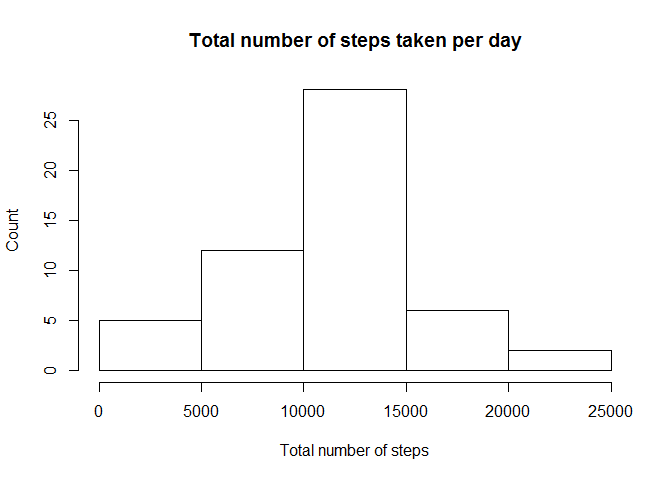
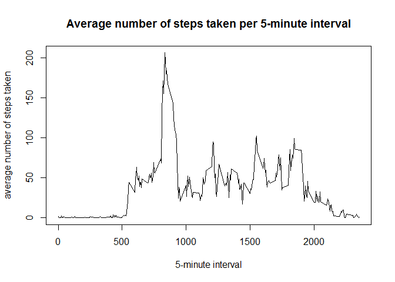
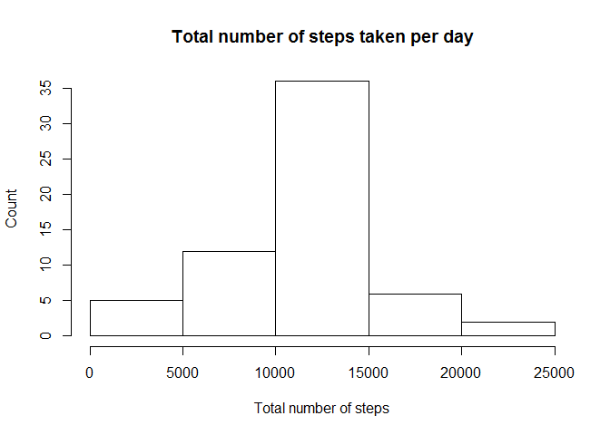
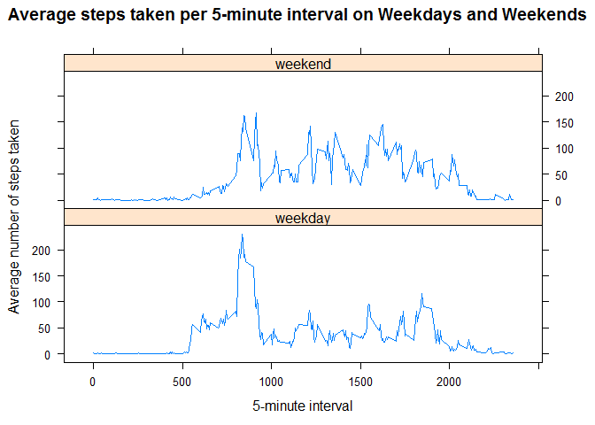

# Reproducible Research: Peer Assessment 1


## Loading and preprocessing the data

```r
temp <- tempfile()
download.file('https://d396qusza40orc.cloudfront.net/repdata%2Fdata%2Factivity.zip', temp)
activityData <- read.csv(unz(temp, 'activity.csv'))
unlink(temp)
```


```r
activityData$date <- as.Date(activityData$date)
activityData$steps <- as.numeric(activityData$steps)
activityData$interval <- as.numeric(activityData$interval)
```

## What is mean total number of steps taken per day?

1. Calculate the total number of steps taken per day

```r
stepsPerDay <- aggregate(steps ~ date, data = activityData, FUN = sum)
stepsPerDay <- stepsPerDay[!is.na(stepsPerDay$steps),]$steps
```

2. Histogram of total number of steps taken each day

```r
hist(x = stepsPerDay, xlab = 'Total number of steps', ylab = 'Count', main = 'Total number of steps taken per day')
```

<!-- -->

3. Mean and median of the total number of steps taken per day

```r
mean(stepsPerDay)
```

```
## [1] 10766.19
```

```r
median(stepsPerDay)
```

```
## [1] 10765
```

## What is the average daily activity pattern?
1. Make a time series plot (i.e. type = "l") of the 5-minute interval (x-axis) and the average number of steps taken, averaged across all days (y-axis)

```r
formattedActivityData <- activityData[!is.na(activityData$steps),]
intervalPerDay <- aggregate(steps ~ interval, data = formattedActivityData, FUN = mean)
plot(x = intervalPerDay$interval, 
     y = intervalPerDay$steps, 
     type = 'l',
     xlab = '5-minute interval',
     ylab = 'average number of steps taken',
     main = 'Average number of steps taken per 5-minute interval')
```

<!-- -->

2. Which 5-minute interval, on average across all the days in the dataset, contains the maximum number of steps?

```r
maxNumOfSteps <- max(intervalPerDay$steps)
intervalPerDay[intervalPerDay$steps == maxNumOfSteps,]$interval
```

```
## [1] 835
```


## Imputing missing values
1. Calculate and report the total number of missing values in the dataset

```r
nrow(activityData[is.na(activityData$steps),])
```

```
## [1] 2304
```

2. Devise a strategy for filling in all of the missing values in the dataset. The strategy does not need to be sophisticated

   I use the mean for that 5-minute interval as the strategy for filling in all of the missing values.


```r
for (i in 1:nrow(activityData)) {
    if(is.na(activityData$steps[i])) {
        activityData$steps[i] <- (intervalPerDay[intervalPerDay$interval == activityData$interval[i],]$steps)
    }
}
```

3. Histogram of total number of steps taken each day

```r
stepsPerDay <- aggregate(steps ~ date, data = activityData, FUN = sum)
hist(x = stepsPerDay$steps, xlab = 'Total number of steps', ylab = 'Count', main = 'Total number of steps taken per day')
```

<!-- -->

4. Mean and median of the total number of steps taken per day

```r
mean(stepsPerDay$steps)
```

```
## [1] 10766.19
```

```r
median(stepsPerDay$steps)
```

```
## [1] 10766.19
```

5. What is the impact of imputing missing data on the estimates of the total daily number of steps?   
   The mean is remain unchanged, but the median has changed and equals to the mean.

## Are there differences in activity patterns between weekdays and weekends?
1. Create a new factor variable in the dataset with two levels - "weekday" and "weekend" indicating whether a given date is a weekday or weekend day.

```r
activityData$day <- weekdays(activityData$date)
activityData$dayType <- 'weekday'
activityData$dayType[activityData$day %in% c('Saturday', 'Sunday')] <- 'weekend'
```

2. Make a panel plot containing a time series plot (i.e. type = "l") of the 5-minute interval (x-axis) and the average number of steps taken, averaged across all weekday days or weekend days (y-axis). 

```r
dayAverage <- aggregate(steps ~ dayType + interval, data = activityData, FUN = mean)
colnames(dayAverage) <- c('dayType', 'interval', 'averageSteps')

library(lattice)

xyplot(averageSteps ~ interval | dayType, 
       data = dayAverage, 
       type = 'l', 
       layout = c(1,2), 
       xlab = '5-minute interval', 
       ylab = 'Average number of steps taken', 
       main = 'Average steps taken per 5-minute interval on Weekdays and Weekends')
```

<!-- -->
